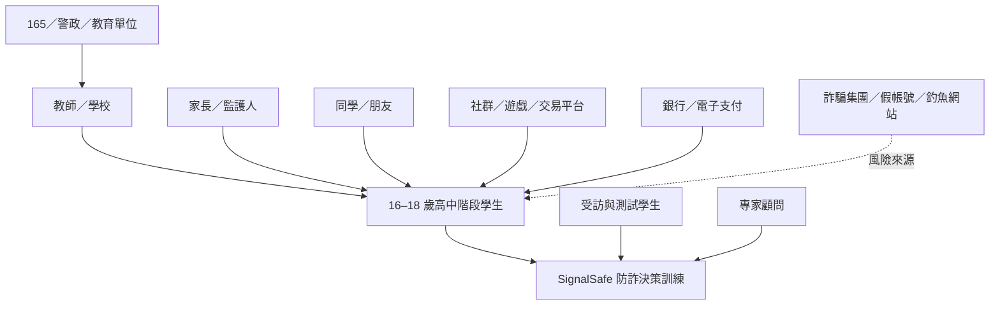

# 作業一：訪談目標對象及探索議題

更新日期：2026-08-01

## 分支圖片

1. [1-1 利害關係人盤點](../../assets/assignments/assignment-1/01-stakeholder-map.svg)
2. [1-2 目標族群與重要性](../../assets/assignments/assignment-1/02-target-audience-analysis.svg)
3. [1-3 三位探索性訪談](../../assets/assignments/assignment-1/03-exploratory-interviews.svg)

## 1｜利害關係人盤點

### 核心層

- **16–18 歲高中階段學生**
  - 普通型高中學生
  - 技術型高中學生
  - 符合年齡的五專低年級學生
- SignalSafe：防詐決策訓練系統

### 直接影響層

- 教師／學校：課堂導入、活動安排與教學支持
- 家長／監護人：陪伴討論與查證支持
- 同學／朋友：訊息互動來源與互相提醒
- 導師／專家顧問：方向修正與專業建議
- 專案團隊：研究、設計、題庫及開發
- 受訪與測試學生：提供需求及使用回饋

### 間接影響層

- 165 反詐騙專線／警政單位
- 教育部／學校行政單位
- 社群、通訊、遊戲、電商、票券與二手交易平台
- 銀行／電子支付業者
- 事實查核與防詐教育組織
- 媒體、KOL 與社群宣導者
- AI／技術協作者

### 風險角色

- 詐騙集團
- 假帳號與遭盜帳號
- 惡意網站與釣魚頁面

## 2｜主要目標族群與重要性

### 主要目標族群

> **16–18 歲高中階段學生。**

### 為什麼重要

1. 高頻接觸社群、通訊、遊戲、影音與數位服務。
2. 自主處理購物、票券、打工、活動、帳號與付款的機會增加。
3. 熟悉科技不代表具有穩定判斷流程。
4. 熟人帳號、限時活動、投票與錯失機會情境可能降低警覺。
5. 可透過班級、課程、社團與校園活動進行驗證及推廣。

### 現行產品目標

- 辨識高風險操作
- 找出最重要風險訊號
- 停止點擊、登入、付款或提供資料
- 改走官方且獨立的查證管道
- 知道如何封鎖、檢舉與求助

## 3｜三位探索性訪談

> 三位受訪者只用於前期需求探索與原型問題發現，不代表所有 16–18 歲學生。

### U001｜大一學生

- 常用平台：Instagram、手機遊戲
- 經驗：曾接到「填問卷中獎、需到現場領獎」電話，因無法確認真實性而未前往
- 判斷方式：搜尋主辦單位、活動地點與相關資訊，並詢問家人或可信任朋友
- 需求：遊戲式互動、真實案例、受害後果、語音或短影片
- 限制：認為五分鐘訓練偏長

### U002｜大一學生

- 常用平台：Threads
- 經驗：曾看到假的遊戲福利，發現內容與官方網站不一致，因此不理會
- 判斷方式：優先比對官方網站，必要時詢問父母
- 需求：遊戲化、封鎖、檢舉與通報教學
- 使用意願：可接受約五分鐘，但不能代表所有學生

### U003｜高中升大學階段學生

- 常用平台：Instagram、Facebook、LINE
- 經驗：遇到可疑內容時傾向不回覆、不提供個資
- 判斷方式：依訊息內容、來源與要求行為判斷
- 需求：直接教導判斷、故事情境、互動性及較短流程
- 測試狀況：完成訪談與前測 8 題，未完成訓練與後測，不納入成效比較

## 4｜共同發現

- 接觸情境主要來自社群、通訊、遊戲及活動內容
- 三位皆已有基本警覺
- 常見安全習慣是不立即回覆、不提供個資、比對官方資訊及詢問家人
- 真正缺口是系統化判斷流程與後續處理步驟
- 遊戲化、情境化與具體後果有初步需求
- 日常使用時間應短，但最佳長度尚未驗證

## 5｜訪談後產品修正

1. 日常快練縮短為約 60–90 秒。
2. 日常模式只要求「最安全行動＋一個最重要訊號」。
3. 研究模式保留三分類、證據與自信。
4. 強化官方查證、封鎖、檢舉與求助路徑。
5. 修正全部選高風險仍取得高分的漏洞。
6. 以 16–18 歲學生重新執行正式可用性與成效驗證。

## 6｜完成狀態與限制

- [x] 利害關係人盤點
- [x] 目標族群與重要性
- [x] 三位探索性訪談
- [x] 共通發現與產品修正方向
- [x] 分支圖片與文字同步
- [ ] 以正式 16–18 歲樣本補強需求證據

限制：樣本僅三位，且兩位為大一、一位為高中升大學階段；不得宣稱已代表全體高中生或證明教育成效。
