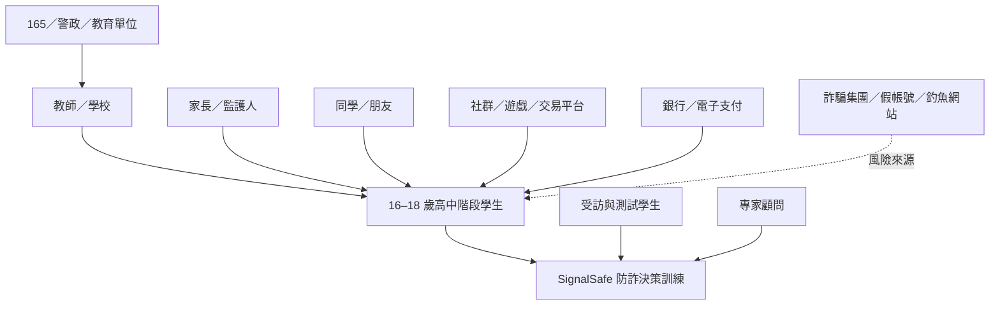

# 作業一：訪談目標對象及探索議題

## 1. 利害關係人盤點

### 現行核心層

- **16–18 歲高中階段學生**
  - 普通型高中學生
  - 技術型高中學生
  - 符合年齡的五專低年級學生
- SignalSafe：防詐決策訓練系統

### 直接影響層

- 教師／學校：課堂導入、活動安排、教學支持
- 家長／監護人：陪伴討論、查證支持
- 同學／朋友：訊息與社群互動來源、互相提醒
- 導師／專家顧問：方向修正與專業建議
- 專案團隊：研究、設計、題庫與開發
- 受訪及測試學生：提供需求與使用回饋

### 間接影響層

- 165 反詐騙專線／警政單位
- 教育部／學校行政單位
- 社群與通訊平台
- 遊戲、電商、票券及二手交易平台
- 銀行／電子支付業者
- 事實查核與防詐教育組織
- 媒體、KOL 與社群宣導者
- AI／技術協作者

### 風險角色

- 詐騙集團
- 假帳號與遭盜帳號
- 惡意網站與釣魚頁面

## 2. 主要目標族群與重要性

### 主要目標族群

> **16–18 歲高中階段學生。**

### 為什麼重要

1. **高度接觸數位環境**：長時間使用社群、通訊、遊戲、影音與數位服務。
2. **自主決策快速增加**：逐步自行處理購物、票券、打工、活動、帳號及付款相關決定。
3. **熟悉科技不等於穩定判斷**：即使已有基本防詐警覺，仍可能依賴直覺或單一關鍵字。
4. **熟人與社交情境會降低警覺**：朋友帳號、限時活動、投票、福利與錯失機會情境容易影響判斷。
5. **適合校園介入**：可透過班級、課程、社團及校園活動進行測試與推廣。

### 現行產品目標

- 訓練學生辨識高風險操作
- 找出最重要的風險訊號
- 停止點擊、登入、付款或提供資料
- 改走官方且獨立的查證管道
- 知道如何封鎖、檢舉及求助

## 3. 三位探索性訪談

> 三位受訪者資料用於前期需求探索及原型問題發現，不代表所有 16–18 歲學生。

### U001｜大一學生

- 常用平台：Instagram、手機遊戲
- 實際經驗：曾接到「填問卷中獎、需到現場領獎」電話，因無法確認真實性而未前往
- 判斷方式：搜尋主辦單位、活動地點及相關資訊，並詢問家人或可信任朋友
- 產品需求：遊戲式互動、真實案例、受害後果、語音或短影片
- 使用限制：認為五分鐘訓練偏長，日常流程應更精簡

### U002｜大一學生

- 常用平台：Threads
- 實際經驗：曾看到假的遊戲福利，發現內容與官方網站不一致，因此不理會
- 判斷方式：優先比對官方網站，必要時詢問父母
- 產品需求：遊戲化設計、封鎖、檢舉與通報教學
- 使用意願：可接受約五分鐘流程，但此意見不能代表所有學生

### U003｜高中升大學階段學生

- 常用平台：Instagram、Facebook、LINE
- 實際經驗：曾遇到可疑或疑似詐騙內容，傾向不回覆、不提供個資
- 判斷方式：依訊息內容、來源與要求行為判斷
- 產品需求：直接教導如何判斷詐騙、故事情境、互動性與較短流程
- 測試狀況：完成訪談及前測 8 題，未完成訓練與後測，不納入前後測成效比較

## 4. 共同發現

- 主要接觸情境來自社群、通訊、遊戲及活動內容
- 三位皆已有基本警覺，並非完全不懂防詐
- 常見安全習慣包括不立即回覆、不提供個資、比對官方資訊、詢問家人
- 真正缺口是系統化判斷流程與後續處理步驟
- 遊戲化、情境化及具體後果有初步需求
- 日常使用時間應短，但尚未驗證最佳長度

## 5. 訪談後產品修正方向

1. 日常快練縮短為約 60–90 秒。
2. 日常模式只要求「最安全行動＋一個最重要訊號」。
3. 研究模式保留三分類、證據與自信程度。
4. 強化官方查證、封鎖、檢舉及求助路徑。
5. 不讓全部選高風險仍取得高分。
6. 以 16–18 歲學生重新執行正式可用性與成效驗證。

## 6. 研究限制

- 樣本僅三位
- 兩位為大一學生，一位為高中升大學階段
- 不是正式 16–18 歲目標族群樣本
- 訪談結果只能用於探索及修正原型
- 不得宣稱已驗證全體高中生需求或教育成效
